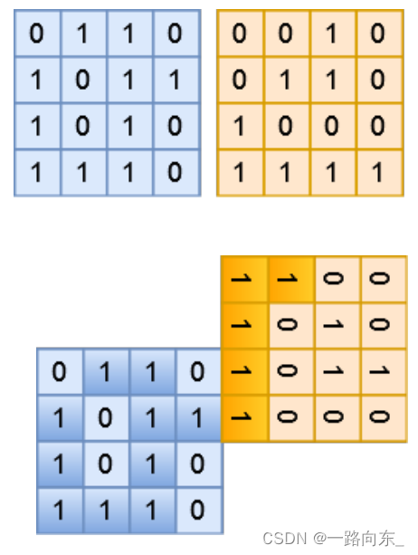

试题 F: 合并区域
【问题描述】
小蓝在玩一款种地游戏。现在他被分配给了两块大小均为 N × N 的正方形 区域。
这两块区域都按照 N × N 的规格进行了均等划分，划分成了若干块面积 相同的小区域，
其中每块小区域要么是岩石，要么就是土壤，在垂直或者水平 方向上相邻的土壤可以组成一块土地。现在小蓝想要对这两块区域沿着边缘进 行合并，
他想知道合并以后可以得到的最大的一块土地的面积是多少（土地的 面积就是土地中土壤小区域的块数）？ 
在进行合并时，小区域之间必须对齐。可以在两块方形区域的任何一条边 上进行合并，
可以对两块方形区域进行 90 度、180 度、270 度、360 度的旋转， 但不可以进行上下或左右翻转，并且两块方形区域不可以发生重叠。
【输入格式】
第一行一个整数 N 表示区域大小。 接下来 N 行表示第一块区域，每行 N 个值为 0 或 1 的整数，相邻的整数 之间用空格进行分隔。
值为 0 表示这块小区域是岩石，值为 1 表示这块小区域 是土壤。 再接下来 N 行表示第二块区域，
每行 N 个值为 0 或 1 的整数，相邻的整 数之间用空格进行分隔。值为 0 表示这块小区域是岩石，值为 1 表示这块小区 域是土壤。
【输出格式】
一个整数表示将两块区域合并之后可以产生的最大的土地面积。
【样例输入】
4
0 1 1 0
1 0 1 1
1 0 1 0
1 1 1 0
0 0 1 0
0 1 1 0
1 0 0 0
1 1 1 1
【样例输出】
15
【样例说明】

第一张图展示了样例中的两块区域的布局。第二张图展示了其中一种最佳 的合并方式，此时最大的土地面积为 15。
【评测用例规模与约定】
对于 30% 的数据，1 ≤ N ≤ 5。 对于 60% 的数据，1 ≤ N ≤ 15。 对于 100% 的数据，1 ≤ N ≤ 50。
【思路解析】
这道题没有较好的算法实现，但是容易想到可以使用暴力解决，即围绕一个表建立一张地图。暴力求解，遍历至多4*4*50=800次。所以不会超时.
